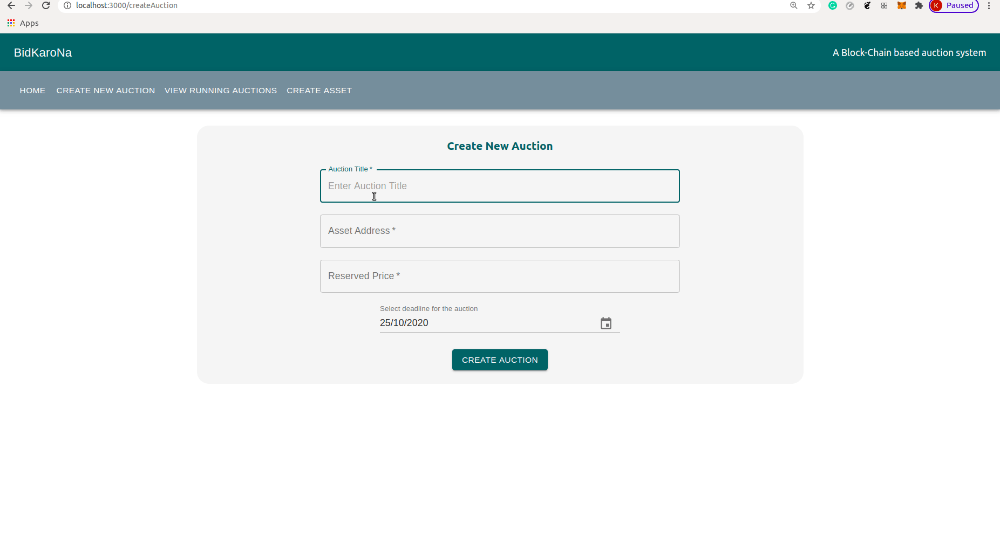
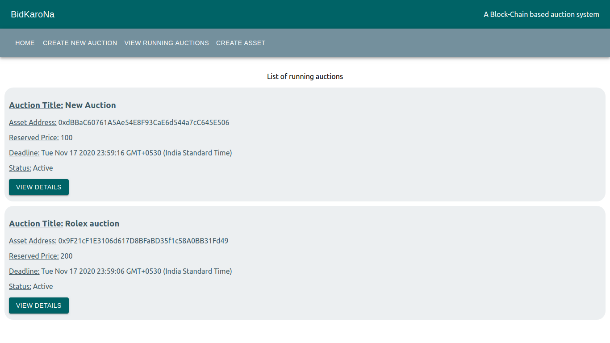
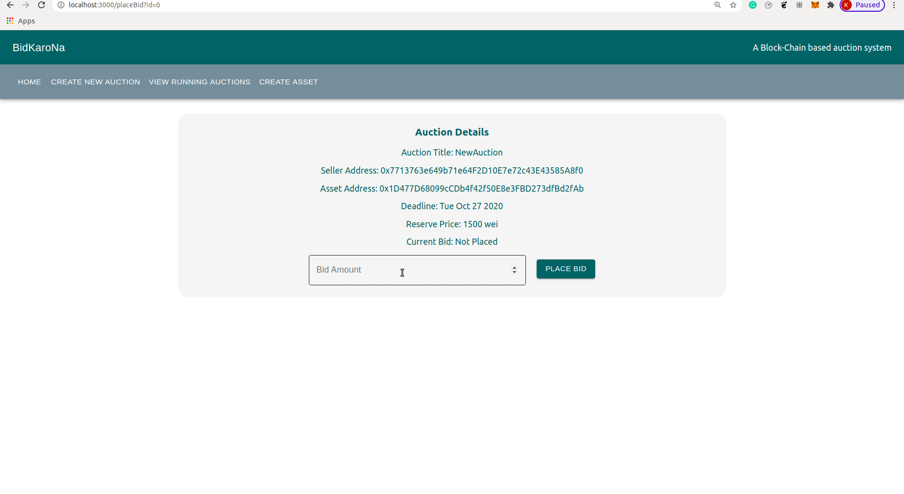

# BidKaroNa

## Description

A full-fledged BlockChain based software web application providing an auctioning platform that ensures complete transparency and security regarding the highest bid and bidder eligibility. We have a blind-bidding design which offers several benefits over the traditional system. The blockchain-based system can ensure transparent and publicly verifiable auctions in IIIT for example in Bakul VolleyBall League.

## Technologies Used

* Truffle
* Ganache
* ReactJS
* Solidity
* Ethereum tools

## How To Run

```bash
truffle migrate
cd client
npm install
npm start
```

## Components

### Create Asset

In order to create an auction, the seller first must have an asset in the blockchain network. And this component allows sellers to do that easily.


### Create Auction

As the core functionality of the system this component will allow sellers to create their decentralized auction through a very efficient user interface.



### View Auctions

This component will allow users (bidders and sellers) to view all the ongoing auctions and allow them to placeBid on any active auction.



### Place Bids

This component will allow users to place or change bid for a specific auction.



<hr/>


